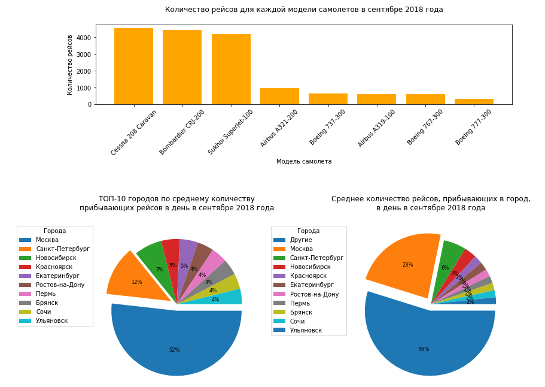

# Анализ спроса пассажиров авиакомпании на рейсы по разным направлениям, а также в города, где проходят крупные фестивали

## Данные

<b>query_1.csv</b>

<ul type="circle">

<li>

<b>model</b> - модель самолета

</li>

<li>

<b>flights_amount</b> - количество рейсов для каждой модели самолетов в сентябре 2018 года

</li>

</ul>

<b>query_3.csv</b>

<ul type="circle">

<li>

<b>city</b> - город

</li>

<li>

<b>average_flights</b> - среднее количество рейсов, прибывающих в город, в день в сентябре 2018 года

</li>

</ul>

<b>query_last.csv</b>

<ul type="circle">

<li>

<b>week_number</b> - номер недели

</li>

<li>

<b>ticket_amount</b> - количество проданных билетов за неделю

</li>

<li>

<b>festival_week</b> - есть ли на этой неделе фестиваль

</li>

<li>

<b>festival_name</b> - название фестиваля

</li>

</ul>

## Задача

 - ***Выбрать ТОП-10 городов*** по среднему количеству прибывающих рейсов в день в сентябре 2018 года.
 - ***Построить графики***:
   - Количество рейсов для каждой модели самолетов в сентябре 2018 года;
   - Cреднее количество рейсов, прибывающих в город, в день в сентябре 2018 года;
   - ТОП-10 городов по среднему количеству прибывающих рейсов в день в сентябре 2018 года.
 - ***Проверить гипотезу***: «Средний спрос на билеты во время фестивалей не отличается от среднего спроса на билеты в обычное время».

## Итоги проекта
 - В рамках проекта было проведено извлечение данных с помощью SQL и библиотеки PySpark.
 - В сентябре 2018 года пассажиры предпочитали в основном летать в Москву (23% рейсов), Санкт-Петербург (6%), Новосибирск (3%). **Почти четверть всех рейсов авиакомпании в стране совершалась в Москву**.
 - Из ТОП-10 городов самыми популярными были Москва (52%), Санкт-Петербург (12%) и Новосибирск (7%). **Москва в рейтинге ТОП-10 занимает первое место с более чем половиной всех рейсов из рейтинга**.
 - Полеты в основном совершались на таких моделях самолетов, как: Cessna 208 Caravan, Bombardier CRJ-200, Sukhoi SuperJet-100.

- Для проверки гипотезы выбрали *t-критерий Стьюдента для независимых выборок*.
- **Не смогли отклонить нулевую гипотезу: средний спрос на билеты во время фестивалей не отличается от среднего спроса на билеты в обычное время**
- **Так как объемы наших выборок очень маленькие, к полученным результатам следует относиться осторожно**

## Библиотеки

 - *pyspark*
 - *pandas*
 - *matplotlib*
 - *numpy*
 - *scipy*
 - *statsmodels* 