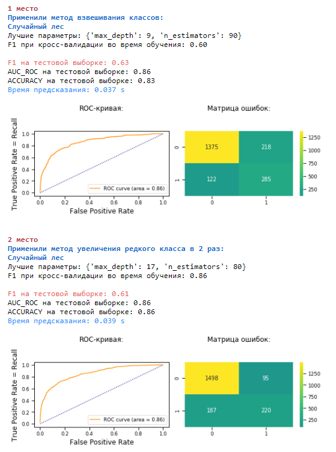

# Построение модели, решающей задачу классификации, для прогнозирования оттока клиентов в банке: уйдёт клиент из банка в ближайшее время или нет.

## Данные
 
- Источник данных: https://www.kaggle.com/barelydedicated/bank-customer-churn-modeling.

- **В данном исследовании представлены исторические данные о поведении клиентов и расторжении договоров с банком**.

## Задача

 - Провести исследовательский анализ данных.
 - Подготовить признаки для построения моделей.
 - Исследовать баланс классов целевого признака.
 - ***Построить модели с предельно большим значением F1-меры >= 0.59:***
   - *Без учета дисбаланса классов*
   - *С учетом дисбаланса классов* и применением методов:
     - Взвешивание классов;
     - Увеличение редкого класса в обучающей выборке;
     - Уменьшение частого класса в обучающей выборке.
 - Проверить модели на тестовой выборке. Выбрать лучшую модель.

## Итоги проекта
 
 - При анализе данных было отмечено:
   - Медианный возраст тех, кто ушел, - 45 лет, это на 10 лет больше, чем у тех, кто остался. **Банк покидают более взрослые клиенты. И для тех, кто остался, возраст выше 55 лет - редкость**. Но редкие клиенты уже старше 70 лет предпочитают больше оставаться, чем уходить.
   - Среди ушедших клиентов есть клиенты с низким кредитным рейтингом (ниже 300). При этом в банке **относительно много текущих клиентов с максимальным кредитным рейтингом. Возможно, для таких клиентов в банке предусмотрена специальная программа обслуживания**.
   - **Наблюдаем очень высокую частоту околонулевых балансов на счетах**, особенно, среди тех, кто остался.
   - Во Франции и Испании уходит относительно немного клиентов по отношению к оставшимся; в Германии уходит почти 50% от тех, кто остается.
   - Чаще уходят мужчины.
 
 - ***Самые лучшие модели***:

 

 -  **Выбор итоговой лучшей модели зависит требований банка (стоимости потери клиента и стоимости попытки его сохранения):**
    - **Первая лучшая модель 218 лояльных клиентов отнесла к ушедшим и 122 ушедших - к оставшимся.**
    - **Вторая лучшая модель допустила меньше ошибок в определении отрицательного класса: 95 лояльных клиентов отнесла к ушедшим, но уже 187 ушедших клиентов отнесла к оставшимся.**
    - **Мы можем понизить порог классификации для того, чтобы ловить больше потенциальных клиентов, которые покинут банк, либо же повысить, чтобы тратить время и деньги на специальные предложения тем, кого модель считает наиболее выроятными к уходу.**

## Библиотеки

 - *pandas*
 - *matplotlib*
 - *seaborn*
 - *numpy*
 - *sklearn*
 - *time*