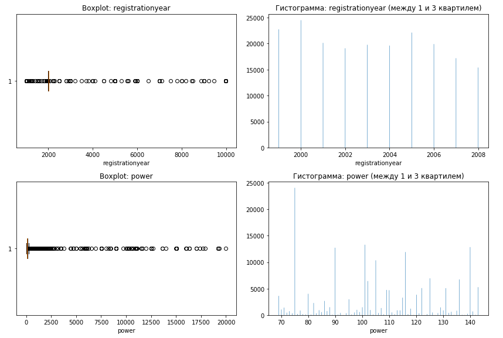
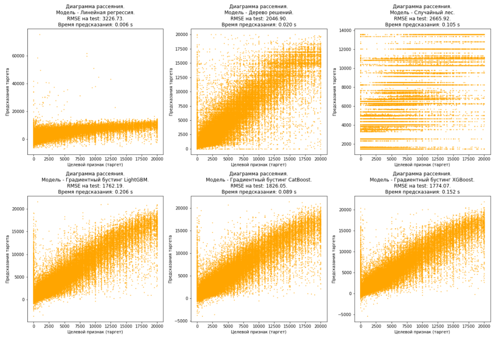

# Прогнозирование рыночной стоимости автомобиля для мобильного приложения сервиса по продаже автомобилей

**Заказчику важны:**

- качество предсказания
- скорость предсказания
- время обучения

## Данные
 

<b>В данном исследовании представлены исторические данные:  технические характеристики, комплектации и цены автомобилей</b>

<ul type="circle">

<li>

<b>DateCrawled</b> — дата скачивания анкеты из базы

</li>

<li>

<b>VehicleType</b> — тип автомобильного кузова

</li>

<li>

<b>RegistrationYear</b> — год регистрации автомобиля

</li>

<li>

<b>Gearbox</b> — тип коробки передач

</li>

<li>

<b>Power</b> — мощность (л. с.)

</li>

<li>

<b>Model</b> — модель автомобиля

</li>

<li>

<b>Kilometer</b> — пробег (км)

</li>

<li>

<b>RegistrationMonth</b> — месяц регистрации автомобиля

</li>

<li>

<b>FuelType</b> — тип топлива

</li>

<li>

<b>Brand</b> — марка автомобиля

</li>

<li>

<b>NotRepaired</b> — была машина в ремонте или нет

</li>

<li>

<b>DateCreated</b> — дата создания анкеты

</li>

<li>

<b>NumberOfPictures</b> — количество фотографий автомобиля

</li>

<li>

<b>PostalCode</b> — почтовый индекс владельца анкеты (пользователя)

</li>

<li>

<b>LastSeen</b> — дата последней активности пользователя

</li>

<li>

<b>Price</b> — целевой признак, цена (евро)

</li>
    
</ul>

## Задача

 - Провести исследовательский анализ данных.
 - Подготовить признаки для построения моделей.
 - ***Построить модели для прогнозирования рыночной стоимости автомобиля: Линейная регрессия, Дерево решений, Случайный лес, Градиентный бустинг LightGBM, Градиентный бустинг CatBoost, Градиентный бустинг XGBoost***. Подобрать гиперпараметры.
 - Проверить модели на тестовой выборке. Для оценки качества моделей применить метрику **RMSE**. Выбрать лучшую модель.

## Итоги проекта

 - При исследовании признаков **обнаружили аномалии в `registrationyear` и `power`**.

 - С учетом предположения, что разрабатываемое приложение перед прогнозированием цены машины будет проверять введенные данные на релистичность, найденные аномалии были удалены:
   - `power`: в датасете выражается в лошадиных силах. На сегодняшний день самые мощные машины - около 5000 л.с. Поэтому всё, что выше этого значения, удалили.
   - `registrationyear`: оставили значения до 2020 года, и всё, что выше границы q1-3iqr. Остальное удалили.

 - ***Результаты тестирования моделей***:

 - ***Анализ моделей***:
   - Самая лучшая модель по качеству среди простых моделей - Дерево решений.
   - Самые лучшие модели по качеству среди всех моделей - Градиентный бустинг LightGBM и Градиентный бустинг XGBoost, при этом скорость предсказания у обеих моделей одинаковая, но скорость обучения у LightGBM гораздо лучше.
   - Самые худшие модели по качеству - Линейная регрессия и Случайный лес.
   - Медленнее всех обучаются Случайный лес, Градиентный бустинг XGBoost, Градиентный бустинг CatBoost.
   - Почти у всех моделей наибольший вес имеют признаки: `registrationyear`, `power`, `kilometer`. Но LightGBM поставил на первое место признак `model`. Самыми "невостребованными" оказались признаки: `registrationmonth`, `gearbox`, `fueltype`.
   - **Для предсказания цены в приложении будем использовать модель Градиентный бустинг LightGBM, которая имеет лучшие характеристики по качеству и скорости обучения и хорошую скорость предсказания**.

## Библиотеки

 - *pandas*
 - *matplotlib*
 - *numpy*
 - *sklearn*
 - *catboost*
 - *xgboost*
 - *lightgbm*
 - *time*