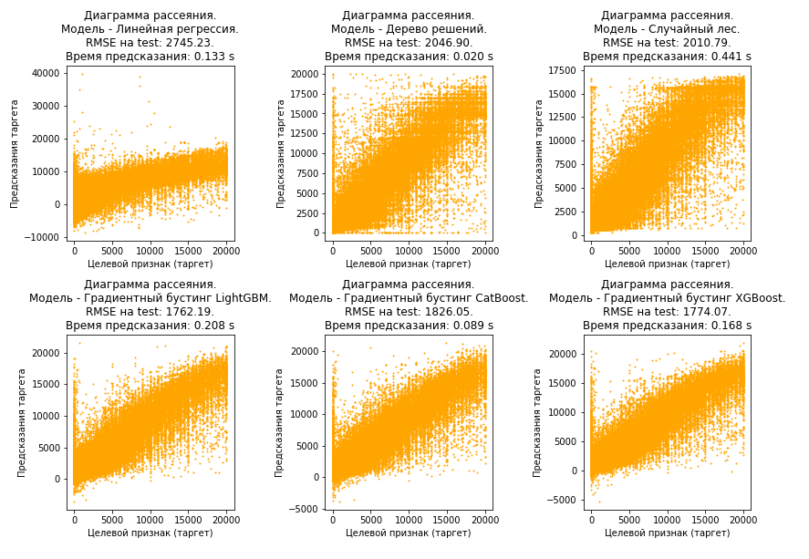

# Прогнозирование рыночной стоимости автомобиля для мобильного приложения сервиса по продаже автомобилей

**Заказчику важны:**

- качество предсказания
- скорость предсказания
- время обучения

## Данные
 
**В данном исследовании представлены исторические данные:  технические характеристики, комплектации и цены автомобилей.**

## Задача

 - Провести исследовательский анализ данных.
 - Подготовить признаки для построения моделей.
 - ***Построить модели для прогнозирования рыночной стоимости автомобиля: Линейная регрессия, Дерево решений, Случайный лес, Градиентный бустинг LightGBM, Градиентный бустинг CatBoost, Градиентный бустинг XGBoost***. Подобрать гиперпараметры.
 - Проверить модели на тестовой выборке. Для оценки качества моделей применить метрику **RMSE**. Выбрать лучшую модель.

## Итоги проекта

 - При исследовании признаков **обнаружили аномалии в `registrationyear` и `power`**.

 - С учетом предположения, что разрабатываемое приложение перед прогнозированием цены машины будет проверять введенные данные на релистичность, найденные аномалии были удалены:
   - `power`: в датасете выражается в лошадиных силах. На сегодняшний день самые мощные машины - около 5000 л.с. Поэтому всё, что выше этого значения, удалили.
   - `registrationyear`: оставили значения до 2020 года, и всё, что выше границы q1-3iqr. Остальное удалили.

 - ***Результаты тестирования моделей***:

 - ***Анализ моделей***:
   - Самая лучшая модель по качеству среди простых моделей - Случайный лес.
   - Самые лучшие модели по качеству среди всех моделей - Градиентный бустинг LightGBM и Градиентный бустинг XGBoost, при этом скорость предсказания у обеих моделей одинаковая, но скорость обучения у LightGBM гораздо лучше.
   - Самая худшая модель по качеству - Линейная регрессия.
   - Медленнее всех обучается Случайный лес.
   - **Для предсказания цены в приложении будем использовать модель Градиентный бустинг LightGBM, которая имеет лучшие характеристики по качеству и скорости обучения и хорошую скорость предсказания**.

## Библиотеки

 - *pandas*
 - *matplotlib*
 - *numpy*
 - *sklearn*
 - *catboost*
 - *xgboost*
 - *lightgbm*
 - *time*