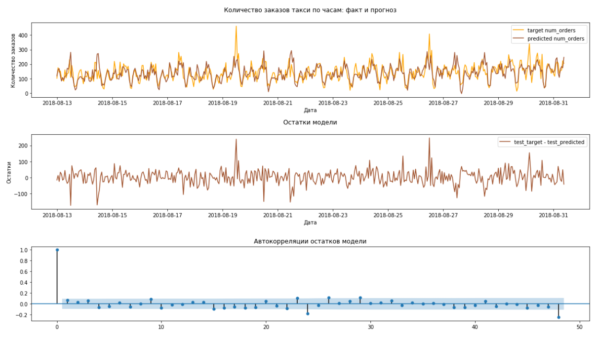
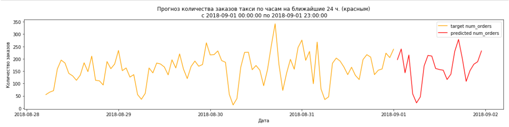

# Прогнозирование количества заказов такси на следующий час в аэропортах

## Данные

***В данном исследовании представлены исторические данные о заказах такси в аэропортах***

## Задача

 - Провести исследование временного ряда.
 - Построить модели для прогнозирования количества заказов такси на следующий час в аэропортах с целью привлечения водителей в период пиковой нагрузки. Проверить модели на тестовой выборке. Значение метрики RMSE на тестовой выборке должно быть не больше 48.
 - Выбрать лучшую модель, сделать анализ остатков лучшей модели.

## В рамках проекта было проведено:
 - Ресемплирование данных, исследование временного ряда (выбросы, тренд, сезонность, автокорреляции), проверка ряда на стационарность с помощью теста Дики-Фуллера, дифференцирование ряда на сезонный лаг.
 - Создание новых признаков для моделей (час, день недели, смещенный на разную величину лага ряд).
 - Построение регрессионных моделей: Линейная регрессия, Дерево решений, Случайный лес, Градиентный бустинг. Выбор лучшей модели с RMSE на тестовой выборке не больше 48, анализ остатков лучшей модели.
 - Была выбрана самая лучшая модель: Линейная регрессия с RMSE на тестовой выборке = 45.58. Анализ остатков модели показал, что модель взяла из данных максимум информации. При помощи данной модели был сделан прогноз ряда на следующие 24 часа вперед.

## Библиотеки

 - *pandas*
 - *matplotlib*
 - *numpy*
 - *sklearn*
 - *lightgbm*
 - *statsmodels*
 - *scipy*