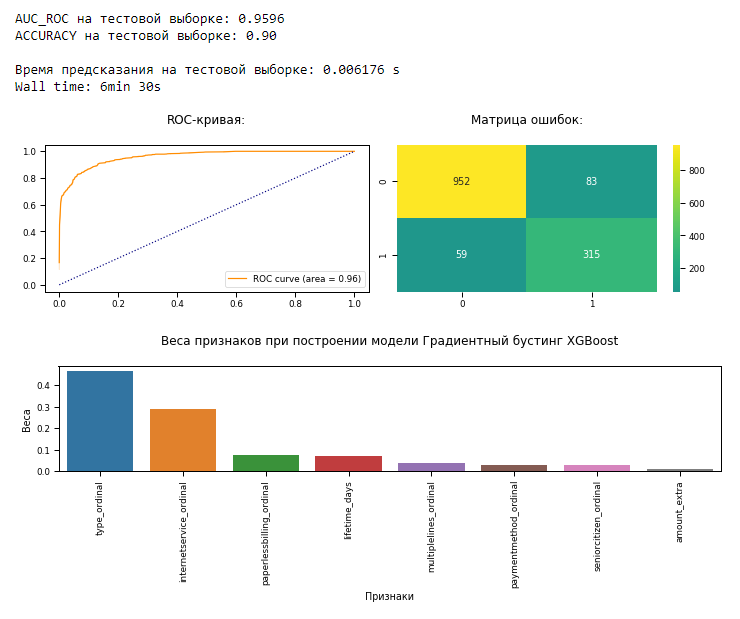

# Прогнозирование оттока клиентов у оператора связи

## Данные
 
- **В данном исследовании представлены данные о некоторых клиентах, информация об их тарифах и договорах**.

## Задача

 - Провести исследовательский анализ данных.
 - Выбрать признаки для построения моделей, создать новые признаки, подготовить.
 - Исследовать баланс классов целевого признака.
 - Построить модели для прогнозирования оттока клиентов.
 - Проверить модели на тестовой выборке. Выбрать лучшую модель.

## Итоги проекта
 
 - При анализе данных было отмечено:
   - **Ушедшие абоненты платили больше в месяц, но в целом оставили меньше денег за все время пользования услугами**. И **уходили они быстро**: 25% уходили через 3-4 месяца, 50% - максимум через 10 месяцев. При этом у ушедших абонентов часто были **подключены доп услуги**, которые могли нежелательным образом увеличивать плату в месяц.
   - **Ушедшие абоненты платили в основном помесячно**, предпочитали метод оплаты Electronic check, многие пользовались **оптоволокном**. Возможно, они **вовремя не узнали о других методах оплаты и других способах подключения к интернету**.
   - **Абоненты со сроком жизни до 3 месяцев с большей вероятностью могут покинуть оператора в любой момент. Здесь важно проводить с новичками работу, рассказывать им обо всех скидках, акциях, тарифах**.
 
 - ***Самая лучшая модель***: *XGBoostClassifier с `AUC_ROC` = 0,96 и `ACCURACY` = 0,9*

 

## Библиотеки

 - *pandas*
 - *numpy*
 - *matplotlib*
 - *seaborn*
 - *xgboost*
 - *sklearn*
 - *time*